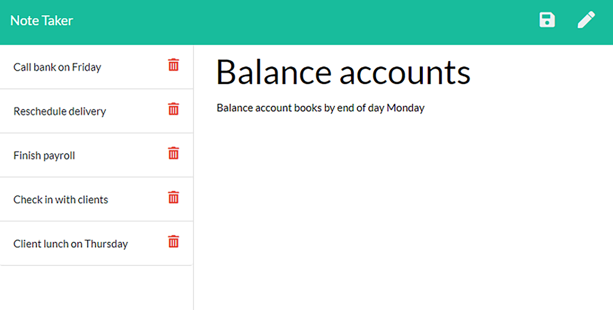

# Note Taker Application

## Description
As a small business owner, the user wants to be able to write and save notes so that they can organize their thoughts and keep track of tasks they need to complete.

## Table of Contents
* [Technologies](#technologies)
* [Mockups](#mockups)
* [Requirements](#requirements)
* [Links](#links)

## Technologies
1. Express.js
2. Javascript
3. HTML
4. CSS

## Mockups

## Requirements
1. When the user wants to use the Note Taker application, they are presented with a landing page with a link to a notes page
2. If they user clicks on the link to the notes page, they are taken to a page with existing notes listed in the left-hand column, plus empty fields to enter a new note title and the note’s text in the right-hand column
3. When they enter a new note title and the note’s text, they can then save using the icon that appears in the navigation at the top of the page
4. The user clicks save and the new note they have entered is saved and appears in the left-hand column with the other existing notes
5. When they click on an existing note in the list in the left-hand column, that note appears in the right-hand column
6. Lastly, the user can click on the Write icon in the navigation at the top of the page and they are given empty fields to enter a new note title and the note’s text in the right-hand column

## Links
* [Note Taker Deployed App](https://guarded-brook-07046.herokuapp.com/)
* [Note Taker App Repository](https://github.com/bspiewak6/note-taker)
